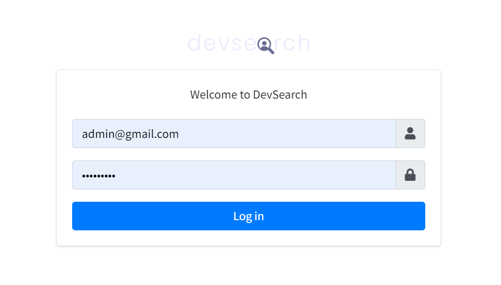
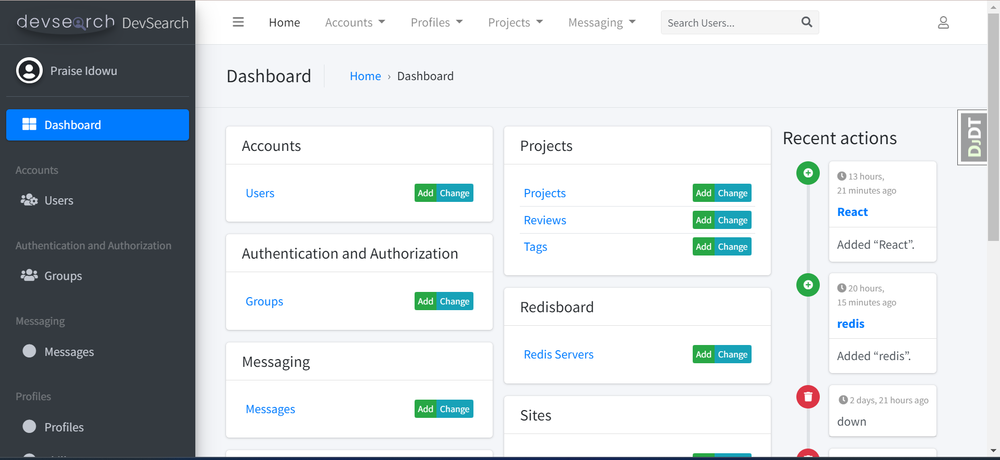
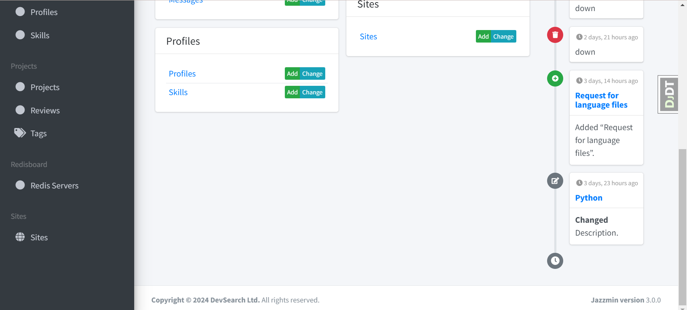

# DevSearch

# Features
* Share Projects
* Message other developers
* Rate others work
* Search other developers

# Tech Stack
* Django
* Postgres
* LLM(LangChain)
* Docker
  
# How to run locally
* Download this repo or run: 
```bash
    $ git clone https://github.com/praise002/devsearch.git
```

#### In the root directory:
- Create and activate a virtual environment
- Install all dependencies
```bash
    $ pip install -r requirements.txt
```
- Create an `.env` file and copy the contents from the `.env.example` to the file and set the respective values. A postgres database can be created with PG ADMIN or psql

- Run Locally
```bash
    $ python manage.py migrate
```
```bash
    $ python manage.py runserver
```

- Run With Docker
```bash
    $ docker-compose up  
```
```bash
    $ docker compose exec web python manage.py migrate
```
```bash
    $ docker compose exec web python manage.py createsuperuser
```
```bash
    $ docker-compose exec web python manage.py collectstatic
```
```bash
    $ http://localhost:8000/
```

# Home Page
  

# Projects Page
  

# Profile Page
  

# User Inbox
  

# Admin login
  

# Admin dashboard
  
  

